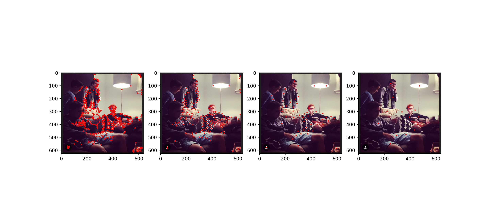

# PySIFT

This project contains an implementation of the SIFT keypoint extraction algorithm in Python and I recommend you to read the paper first https://www.cs.ubc.ca/~lowe/papers/ijcv04.pdf by David G. Lowe

## Usage

Pass in a filename for the `--input` argument and a prefix for the `--output` parameter. In addition to plotting the keypoints, `main.py` will save `results/<prefix>_kp_pyr.pkl` and `results/<prefix>_feats_pyr.pkl` files containing the computed features.

## Warning

I do not maintain this repository. The code is provided as-is, so if you encounter an issue (which is likely) I would advise you to try and fix it yourself.

Also, if anyone wants to maintain this repository, leave an issue and I will gladly add you as a collaborator or transfer ownership.

## Limitations 

The code is unoptimized. This means that I took time to implement each step of SIFT as described in the paper as faithfully as I could but I did not do a second pass over the implementation for optimization. Therefore, on any reasonably-sized image, it should be fairly slow.

In addition, there is currently a mistake in the keypoint scaling. When scaled up from the higher levels of the pyramid, they get off center. This can be seen in the following example:

